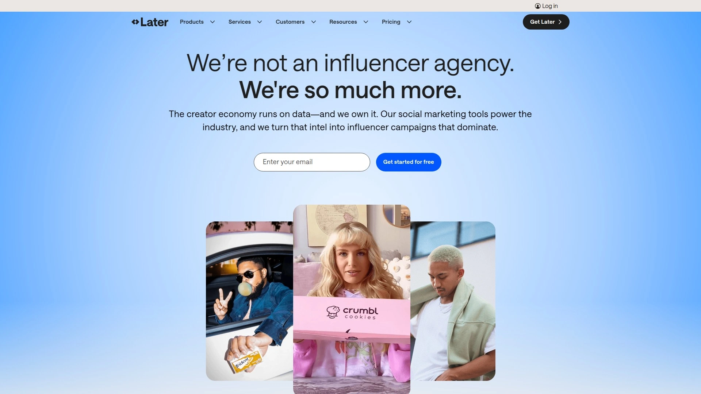
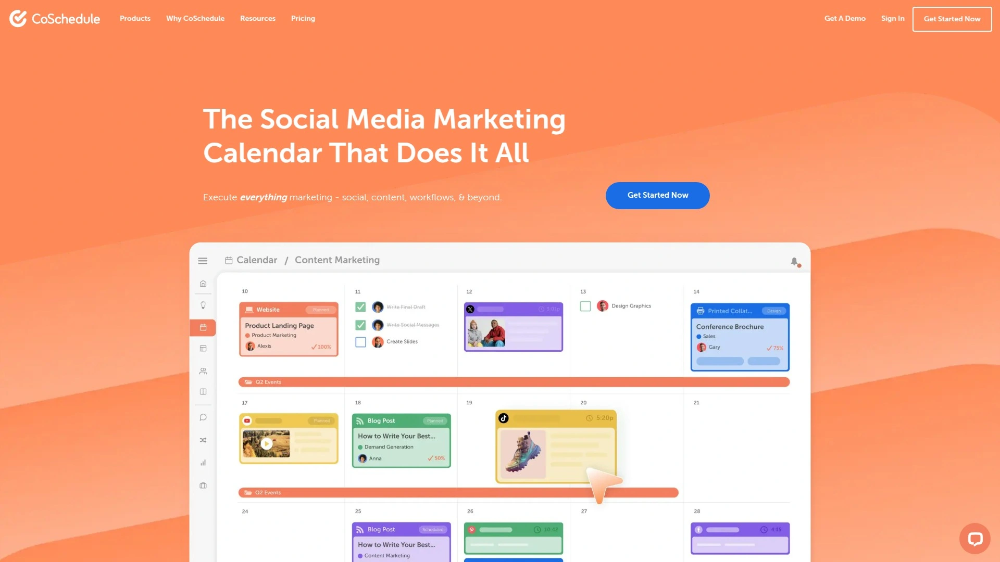

# 2025's Top 12 Best Social Media Management Tools

Managing multiple social platforms can feel overwhelming when you're juggling content creation, scheduling, and audience engagement all at once. The right social media management tool streamlines your workflow, automates repetitive tasks, and helps you maintain a consistent online presence without burning out. These platforms offer scheduling capabilities, analytics tracking, content discovery, and team collaboration features that transform chaotic posting into strategic marketing.

***

## **[Crowdfire](https://crowdfireapp.com)**

All-in-one social media assistant for discovering and scheduling content across major platforms.

Crowdfire simplifies content management by automatically curating articles and images tailored to your niche, eliminating hours of manual research. The platform connects seamlessly with Twitter, Pinterest, Facebook, Instagram, LinkedIn, TikTok, YouTube, WordPress, Shopify, and Etsy, allowing you to manage diverse accounts from one centralized dashboard.

The scheduling system includes best-time recommendations based on your followers' activity patterns, maximizing engagement potential without guesswork. Queue Meter functionality alerts you when your scheduled content runs low, ensuring consistent posting frequency. Content automatically adapts formatting for each platform, so your Instagram post transforms appropriately for LinkedIn without manual adjustments.

The mentions monitoring feature tracks brand conversations across all connected accounts, enabling quick responses directly within the platform rather than switching between multiple apps. RSS feed integration keeps your favorite content sources accessible in one location, streamlining your curation workflow. The detailed preview system shows exactly how posts will appear before publication, reducing formatting errors.

Built-in analytics help you understand which content resonates with audiences, while customizable posting schedules accommodate different time zones and platform-specific optimal windows.

***

## **[Buffer](https://buffer.com)**

Straightforward scheduling platform designed for small businesses managing multiple social channels efficiently.

Buffer delivers dead-simple post scheduling across Facebook, Instagram, Twitter, LinkedIn, TikTok, YouTube, Mastodon, Bluesky, Threads, Pinterest, and Google Business Profile. The queue system automatically slots content into predefined time slots, eliminating the need to manually schedule each individual post. Free users can connect three social accounts with ten scheduled posts per channel, making it accessible for startups testing social strategies.

The tailored posts composer allows customization for each network from a single draft, so you can add platform-specific text lengths, hashtags, or calls-to-action without creating separate posts from scratch. First comment scheduling for Instagram keeps captions clean while maintaining hashtag strategy. LinkedIn carousel support and YouTube Shorts scheduling expand content format flexibility.

Buffer's analytics track post performance up to 30 days with custom date filters, providing actionable insights into content effectiveness. The custom report builder generates tailored analytics presentations for client meetings or internal reviews. AI Assistant integration helps rephrase drafts, generate fresh ideas, and optimize copy without leaving the platform.

The Start Page feature creates a link-in-bio landing page directly within your social media management app, consolidating tools. Ideas Kanban board organizes in-progress content, keeping your creative pipeline visible and manageable.

***

## **[Hootsuite](https://hootsuite.com)**

Comprehensive social media command center with advanced scheduling, listening, and team management capabilities.

Hootsuite manages practically every aspect of daily social media operations from one powerful dashboard, supporting Facebook, Instagram, YouTube, LinkedIn, Twitter, Pinterest, and additional platforms. The drag-and-drop content calendar provides visual overview of scheduled posts, simplifying timing adjustments and content strategy visualization. AI-powered OwlyWriter generates captions, content ideas, and hashtag suggestions, accelerating post creation when creative block strikes.

Social listening streams monitor brand conversations in real time, enabling immediate engagement with customers and reputation management. The unified Inbox consolidates private messages and public comments from all connected accounts, eliminating platform-hopping. Auto-responder functionality and saved reply templates speed up customer service responses.

Team collaboration features support multiple users with customizable roles and permissions, ensuring everyone understands their responsibilities while maintaining content quality control. Automated tagging and assignment systems route incoming messages to appropriate team members. Best-time-to-post recommendations leverage platform data to optimize scheduling decisions.

Bulk post scheduling handles weeks of content in one session, while Canva template integration streamlines visual creation. Analytics reports deliver insights into engagement metrics and reach, helping refine strategy based on performance data.

***

## **[SocialBee](https://socialbee.com)**

AI-driven scheduling powerhouse with intelligent content categorization and recycling for consistent posting.

SocialBee excels at AI-powered workflow automation, supporting Facebook, Instagram, Twitter, LinkedIn, Pinterest, TikTok, YouTube, and Google Business Profile. Content Categories represent the platform's standout feature, allowing you to organize posts into specific types like curated content, promotional material, or educational resources, then schedule each category independently.

The Social Media Copilot handles your entire scheduling process autonomously by analyzing your brand, audience, and goals to determine optimal platforms, create categorized content plans, establish posting schedules using best-time recommendations, and generate posts from scratch. This hands-off approach saves dozens of hours monthly for businesses struggling with content planning.

Post recycling ensures evergreen content gets shared repeatedly at strategic intervals, maximizing value from high-performing posts. Post expiration automatically removes time-sensitive content after specified periods or share counts, maintaining feed relevance. Built-in AI writer and media integrations accelerate post creation when filling content queues.

Social listening tools monitor relevant conversations while engagement features help maintain audience relationships. Analytics dashboards track performance metrics, providing data for strategic adjustments.

***

## **[Sprout Social](https://sproutsocial.com)**

Enterprise-grade platform combining publishing, engagement, analytics, and listening for large teams and agencies.

Sprout Social delivers powerful management capabilities designed for organizations handling numerous profiles and complex workflows. The Smart Inbox centralizes conversations from all connected networks, enabling efficient message management and customer support at scale. Advanced analytics and reporting provide deep insights into social performance with customizable metrics.

The interactive calendar offers drag-and-drop rescheduling functionality, making content plan adjustments effortless. Data-driven optimal posting time recommendations ensure maximum audience visibility based on engagement patterns. Collaborative workflows facilitate seamless teamwork with task assignment, post approval systems, and role-based permissions.

Comprehensive social listening monitors brand mentions, industry trends, and competitor activity across platforms. Automated tagging categorizes incoming messages for organized response management. Integration with Google Analytics and GA4 enables tracking customer journeys across devices with minimal configuration.

Platform supports unlimited social profiles on Professional and Advanced plans, accommodating agencies managing multiple client accounts. Competitive reports for Instagram, Facebook, and Twitter provide benchmarking insights, while keyword trend analysis identifies emerging opportunities.

Pricing starts at $199 monthly with additional costs for team members, positioning it as a premium solution for established businesses.

***

## **[Later](https://later.com)**

Visual-first scheduler optimized for Instagram, TikTok, and visual content planning across platforms.

Later specializes in visual content scheduling for Instagram, Facebook, TikTok, LinkedIn, Twitter, and Pinterest. The Visual Planner provides drag-and-drop Instagram feed preview, letting you arrange posts to create aesthetically cohesive grids before publication. Best-time-to-post recommendations learn from your unique audience engagement patterns, suggesting optimal scheduling windows.

Media Library synchronizes across desktop and mobile apps, enabling content upload, download, and scheduling from any device. First comment scheduling keeps Instagram captions clean by automatically posting hashtags separately, maintaining visual appeal while preserving discoverability. Hashtag suggestions boost engagement by recommending relevant tags based on content.

Instagram Reels and TikTok auto-publishing schedules video content to publish automatically at preset times without notifications or manual intervention. Multi-profile scheduling on iOS allows starting with one post and customizing it for each platform quickly. Copy post feature duplicates published content for editing and rescheduling across any platform.

Draft post functionality streamlines content creation by letting you prepare ideas directly in the app and schedule when ready. The platform particularly appeals to influencers, content creators, and visual-focused brands prioritizing Instagram and TikTok growth.

***

## **[Sendible](https://sendible.com)**

Agency-focused management software with white-labeling, client dashboards, and unified inbox capabilities.

Sendible caters specifically to agencies and brands managing multiple client accounts at scale. White-labeling solutions allow agencies to create branded client dashboards with custom colors, email notifications, and domains, generating presentation-ready reports with professional appearances. However, white-label features require additional $299 monthly fees on lower-tier plans.

The platform integrates with Facebook, Instagram, Twitter, LinkedIn, Google Business Profile, YouTube, TikTok, and WordPress. Content calendar, post scheduling, and content queue features organize campaigns efficiently. Canva and Pexels integration streamlines visual creation directly within the workflow.

Unified social inbox consolidates messages from all platforms, enabling centralized communication management. Social feeds and monitoring tools track brand mentions and relevant conversations. RSS feed functionality and Google News alerts keep you informed about industry developments.

Automated email reports deliver performance updates to clients on schedule, while the report builder customizes metrics based on specific client needs. Custom approval workflows ensure content quality before publication, with team member roles and permissions controlling access levels. Mobile apps extend management capabilities beyond desktop.

Task assignment features distribute workload across team members effectively.

***

## **[Loomly](https://loomly.com)**

Workflow-centric platform emphasizing collaboration, content inspiration, and approval processes for teams.

Loomly supports comprehensive social media workflows across Instagram, Facebook, YouTube, TikTok, Google, and additional major networks on all pricing tiers. Calendar-based workspace structure organizes social accounts into distinct projects, ideal for agencies managing multiple clients or international companies coordinating location-specific campaigns.

Post inspiration tools generate content ideas based on trending topics, helping overcome creative blocks. Post preview functionality shows exactly how content appears on each platform before publishing, reducing errors. Google Drive and Canva integrations facilitate collaborative content creation.

Approval workflows ensure every post receives proper review before going live, maintaining brand consistency and quality standards. Custom user roles and permissions define team member capabilities clearly. Real-time feedback and comments enable seamless collaboration on post drafts.

Community management tools consolidate comments and messages from all accounts in one location, preventing missed interactions. Analytics reports track post performance and follower growth with automatic scheduling for client or team distribution. Campaign management features with label organization help track specific campaign performance.

Mobile apps for iOS and Android facilitate content creation and adjustments while away from desktop. Unlimited post scheduling, direct publishing, hashtag management, and link shorteners come standard across all tiers.

---

## **[Agorapulse](https://agorapulse.com)**

Unified social inbox specialist with robust scheduling, monitoring, and team collaboration for mid-size organizations.

Agorapulse delivers clean, intuitive interfaces focused on ease of use and efficient team workflows. The platform manages multiple social accounts from one dashboard, simplifying publishing, engagement, and analytics. Social media scheduling workflow proves particularly efficient with clear calendar views and drag-and-drop functionality.

The unified inbox consolidates all social conversations, allowing task assignment and shared calendar access for seamless team collaboration. Drafts and notes features prove invaluable for multi-person teams coordinating content. Analytics and reporting deliver excellent insights with PowerPoint export functionality for client presentations.

Social listening capabilities monitor brand mentions and relevant industry conversations. Queue management allows automated posting schedules for different content types with repeat functionality for evergreen material. Calendar notes indicate upcoming events for promotion planning.

The platform prioritizes LinkedIn capabilities more than some consumer-focused competitors, supporting professional relationship building. Google Analytics integration tracks customer engagement across devices. Pricing starts at higher tiers than budget alternatives but includes two users at the base Professional plan level.

Support team responds quickly and effectively resolves issues according to user feedback.

***

## **[CoSchedule](https://coschedule.com)**

Marketing calendar combining social scheduling, blog management, and project coordination for content teams.

CoSchedule provides month-by-month calendar views showing scheduled social posts, blog content, and project deadlines in one unified interface. The platform schedules posts to Twitter, Facebook, LinkedIn, and Instagram with automatic publishing. Calendar visualization helps identify content gaps, plan themes, and coordinate campaigns cohesively.

WordPress integration enables content management within the platform or directly in WordPress dashboards according to user preference. Google Docs integration manages content marketing schedules using familiar Google ecosystem tools. Google Analytics connectivity tracks performance metrics while automatically adding UTM parameters to social shares for detailed tracking.

Headline Analyzer tool helps craft compelling titles that drive clicks and shares, similar to email subject line optimization. Free-forever marketing calendar option manages tasks and projects without cost, though social scheduling requires paid plans starting at $19 monthly for multiple profiles.

The platform integrates with YouTube, Google Drive, Dropbox, Slack, Shopify, and additional services, creating flexible workflows. Asset organization and content library features keep files indexed and accessible. Team coordination tools provide visibility into project timelines and help meet production deadlines consistently.

Social Calendar and Marketing Suite plans accommodate different organizational sizes and complexity levels.

***

## **[Publer](https://publer.io)**

Budget-friendly scheduler with generous free plan and bulk scheduling capabilities across extensive platform support.

Publer offers reliable scheduling with exceptionally generous free tier, making it accessible for solopreneurs and startups testing social strategies. The platform supports extensive network coverage including Facebook, Instagram, TikTok, Twitter, LinkedIn, Pinterest, YouTube, Google Business Profile, WordPress, Telegram, Threads, and Mastodon.

Autoschedule feature creates predefined posting schedules by time slot and content type, then automatically queues new posts to the next available slot. This content queue system ensures consistent posting without manually scheduling each piece. Best-times-to-post analysis identifies optimal engagement windows based on historical performance.

Bulk scheduling via CSV upload handles hundreds of posts in one session, dramatically reducing administrative time. Post customization allows tailoring content for each platform from a single base draft. Calendar view visualizes content strategy with drag-and-drop organization.

Real-time post preview shows exactly how content appears on each platform before publication. Smart content calendar planning helps organize and visualize social media strategy effectively. The platform maintains simplicity and ease of use while delivering comprehensive scheduling functionality.

Paid plans remain affordable compared to enterprise alternatives, balancing features with cost-effectiveness.

***

## **[Planable](https://planable.io)**

Collaboration-first platform with approval workflows, client feedback tools, and universal content functionality.

Planable specializes in content collaboration, allowing teams to create, approve, and schedule social media posts, blogs, newsletters, emails, and advertisements. Pixel-perfect preview dashboards specific to each social network ensure content appears exactly as intended after publication. Universal Content functionality extends beyond social media to any written content type.

Approval workflows customize content review processes based on team needs, ensuring brand alignment before publication. Team members leave comments directly next to posts, mention colleagues, and add internal notes for behind-the-scenes communication. Custom user roles and permissions control who can view, modify, and approve content.

Guest view links provide clients and stakeholders with content plan overviews without requiring platform login, simplifying feedback collection. Real-time collaboration enables simultaneous drafting and editing by multiple team members. Color-coded labels organize content by campaign, making strategy visualization and filtering straightforward.

Drag-and-drop calendar interface schedules posts effortlessly while post recycling automatically republishes specific content. Media library stores design assets for future reuse with filtering between used, unused, or deleted files. Planable AI elaborates concepts, shortens text, or increases engagement potential.

The platform offers free scheduling for up to fifty total posts with paid plans starting at $33 per user per workspace.

***

## **[Tailwind](https://tailwindapp.com)**

Pinterest and Instagram specialist with AI-powered optimization, SmartSchedule, and advanced hashtag recommendations.

Tailwind focuses specifically on Pinterest and Instagram marketing, offering deep platform-specific optimization. SmartSchedule automatically posts content at times when your audience demonstrates highest engagement, eliminating guesswork. The platform auto-publishes posts and videos without requiring notifications or manual intervention.

Hashtag Finder provides advanced, intuitive recommendations helping posts get discovered by relevant audiences. First comment hashtag scheduling keeps Instagram captions visually clean while maintaining discoverability strategy. Font formatting, user tagging, and location tagging streamline Instagram optimization within the scheduler.

Stories and Carousel scheduling extends capabilities beyond standard posts to diverse content formats. Interval scheduling allows posting the same pin to multiple Pinterest boards with customizable time gaps between publications, maximizing content distribution. This multi-board functionality proves particularly valuable for Pinterest managers handling extensive board networks.

The Free Forever plan provides twenty monthly posts across connected accounts, suitable for casual users. Pro plan costs $14.99 monthly when billed annually, recommended for serious Pinterest marketing efforts. The platform integrates with shops and marketplaces, supporting e-commerce businesses.

Tailwind generates and schedules pins quickly with bulk scheduling capabilities, dramatically reducing time investment.

***

## FAQ

**Which social media management tool works best for small businesses just starting out?**

Buffer and Publer both offer generous free plans perfect for testing social strategies without financial commitment. Buffer provides three social accounts with ten posts per channel, while Publer delivers even broader platform support with its free tier. Both platforms prioritize simplicity, making them ideal for entrepreneurs learning social media management without overwhelming features or steep learning curves.

**How do I choose between budget and premium social media management platforms?**

Evaluate your specific needs around team size, platform support, and advanced features like social listening or white-labeling. Budget options like Buffer, Publer, or Later handle scheduling and basic analytics effectively for small teams. Premium platforms like Sprout Social, Hootsuite, or Agorapulse provide enterprise-grade collaboration, detailed reporting, and unified inboxes justifying higher costs for agencies or large organizations managing complex workflows across numerous accounts.

**Can these tools help me maintain consistent posting without spending hours daily on social media?**

Absolutely—that's their primary purpose. Platforms with content queue systems like SocialBee, Buffer, or Publer let you batch-create content once weekly, then automatically distribute posts at optimal times throughout the week. Features like post recycling, content curation, and AI writing assistants further reduce time investment while maintaining consistent presence. Most users report reducing daily social media management from hours to minutes after implementing proper scheduling workflows.

---

## Conclusion

Choosing the right social media management tool transforms chaotic posting into streamlined strategy, freeing time for business growth while maintaining consistent online presence. Each platform offers distinct strengths—whether you need Budget-friendly scheduling, visual planning capabilities, enterprise collaboration tools, or Pinterest-specific optimization. **[Crowdfire](https://crowdfireapp.com)** stands out for businesses seeking automated content discovery paired with comprehensive platform support, making it particularly suitable for small businesses and solopreneurs wanting intelligent content curation without manual research. The platform's automatic content customization for each network and best-time posting recommendations eliminate guesswork, letting you focus on creating compelling content rather than managing logistics. Test multiple options using free trials to identify which workflow, interface, and feature set aligns best with your specific social media goals and team structure.
